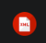
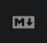

# Documentación UD1 - Lenguaje de Marcas

## 1. Introducción a los lenguajes de marcas

### 1.1 Definición

Un lenguaje de marcas organiza y estructura información mediante una sintaxis basada en **marcas o etiquetas**.

Estas marcas permiten indicar qué función cumple cada parte del contenido, facilitando su interpretación por diferentes programas.

Por ejemplo, en HTML:

```html
<h1>Título</h1>
<p>Este es un párrafo.</p>
```

La etiqueta `<h1>` indica que el contenido es un encabezado y `<p>` que se trata de un párrafo.

### 1.2 Clasificación de los lenguajes de marcas

| Tipo                       | Uso                                                               | Ejemplos           |
| -------------------------- | ----------------------------------------------------------------- | ------------------ |
| Presentación               | Definir o estructurar la presentación de documentos               | HTML, SVG          |
| Intercambio de información | Estructurar y almacenar información para facilitar su intercambio | XML, RSS           |
| Documentación              | Crear documentación estructurada y legible                        | Markdown, Wikitext |

> **Nota:** algunos lenguajes pueden utilizarse para más de una finalidad dependiendo de cómo se empleen.

---

# 2. Instalación y configuración del entorno

## 2.1 Visual Studio Code

Para trabajar con los diferentes lenguajes de marcas se utilizará **Visual Studio Code**.

[Descargar Visual Studio Code](https://code.visualstudio.com/download)

## 2.2 Instalación de extensiones

Las extensiones utilizadas durante la actividad son:

* [Live Preview](https://marketplace.visualstudio.com/items?itemName=ms-vscode.live-server)
* [Markdown All-in-One](https://marketplace.visualstudio.com/items?itemName=yzhang.markdown-all-in-one)
* [HTML / CSS Support](https://marketplace.visualstudio.com/items?itemName=ecmel.vscode-html-css)
* [XML](https://marketplace.visualstudio.com/items?itemName=redhat.vscode-xml)

---

# 3. Instalación de Git

Git permite realizar un control de versiones de los archivos del proyecto.

En sistemas basados en Debian se puede instalar mediante:

```bash
sudo apt install git
```

Una vez instalado, se puede comprobar la versión mediante:

```bash
git --version
```

---

# 4. Configuración del repositorio

Para conectar el proyecto local con un repositorio remoto de GitHub:

```bash
git remote add origin https://github.com/rufo-thedog/linguaxemarcas
git branch -M main
git push -u origin main
```

Posteriormente, para guardar y enviar cambios:

```bash
git add .
git commit -m "Comentario descriptivo"
git push
```

### Flujo básico de trabajo

El proceso habitual puede resumirse en:

```text
Modificar archivos
      ↓
   git add
      ↓
  git commit
      ↓
   git push
      ↓
     GitHub
```

---

# 5. Descripción de las extensiones

| Nombre              | Uso                                                                | Imagen                                   |
| ------------------- | ------------------------------------------------------------------ | ---------------------------------------- |
| XML                 | Facilita la escritura, validación y autocompletado de XML          |             |
| Live Preview        | Permite previsualizar documentos HTML mientras se trabaja en ellos |     |
| HTML / CSS Support  | Facilita la escritura y el autocompletado de HTML y CSS            |     |
| Markdown All-in-One | Añade herramientas para trabajar con documentos Markdown           |  |

> **Nota:** las imágenes se almacenan dentro de la carpeta `img/` del repositorio y se enlazan mediante rutas relativas. De esta forma, las imágenes pueden visualizarse también cuando el repositorio se consulta desde GitHub.

---

# 6. Elementos básicos de Markdown

Markdown permite crear documentos estructurados utilizando una sintaxis sencilla.

### Encabezados

```markdown
# Encabezado 1
## Encabezado 2
### Encabezado 3
```

### Texto

```markdown
**Texto en negrita**

*Texto en cursiva*

~~Texto tachado~~
```

### Listas

Lista sin ordenar:

```markdown
- Elemento 1
- Elemento 2
- Elemento 3
```

Lista ordenada:

```markdown
1. Primer elemento
2. Segundo elemento
3. Tercer elemento
```

### Enlaces

```markdown
[Texto del enlace](https://example.com)
```

### Imágenes

```markdown

```

El texto alternativo permite describir la imagen y resulta especialmente útil cuando esta no puede visualizarse.

---

# 7. Markdown y HTML

Una de las características interesantes de Markdown es que puede utilizarse junto con HTML.

Por ejemplo, un título puede escribirse en Markdown:

```markdown
# Mi título
```

o mediante HTML:

```html
<h1>Mi título</h1>
```

Markdown busca ofrecer una sintaxis más sencilla y legible para crear documentos estructurados, mientras que HTML proporciona un mayor control sobre la estructura de una página web.

Por este motivo, Markdown es muy utilizado para documentación técnica, archivos `README.md` y proyectos almacenados en plataformas como GitHub.

---

# 8. Estructura del proyecto

Para mantener organizados los recursos utilizados en la documentación, se puede utilizar una estructura similar a la siguiente:

```text
linguaxemarcas/
│
├── apuntes/
│   └── UD1.md
│
├── img/
│   ├── xml.png
│   ├── live-preview.png
│   ├── html-css.png
│   └── markdown.png
│
└── README.md
```

Esta organización permite separar el contenido escrito de los recursos gráficos y facilita el mantenimiento del proyecto.

---

# 9. Conclusiones

Durante esta unidad se han introducido los conceptos básicos relacionados con los lenguajes de marcas y se ha configurado el entorno necesario para trabajar con ellos.

Además de conocer diferentes lenguajes y herramientas, se ha trabajado con **Markdown y Git**, dos herramientas especialmente útiles para crear y mantener documentación técnica.

La utilización de un repositorio permite mantener un historial de cambios y disponer de una copia remota del proyecto, mientras que Markdown permite crear documentación sencilla, estructurada y compatible con plataformas como GitHub.
